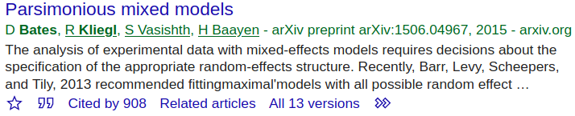
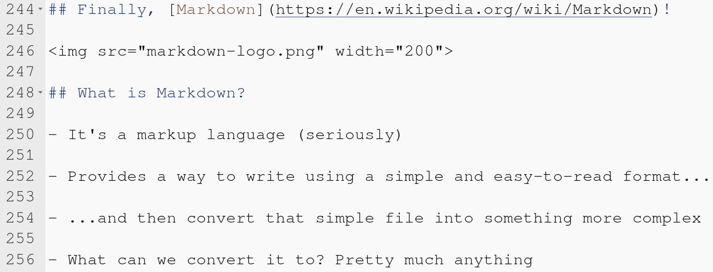
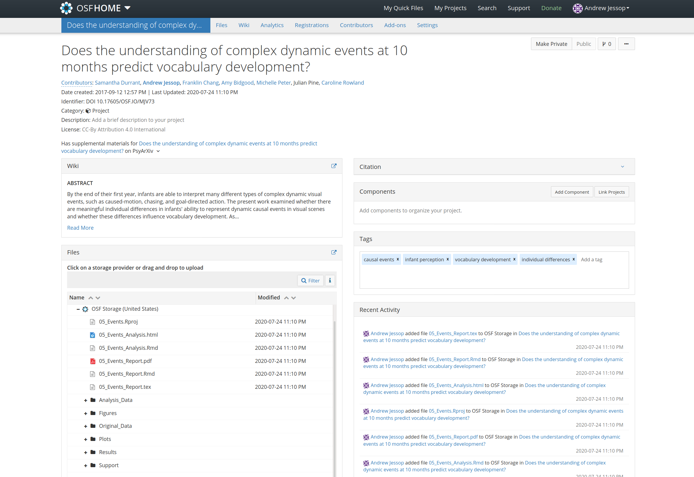

## Summary

- A brief introduction to open science

- What is reproducibility in research?

- Why does reproducibility and transparency matter?

- How can markdown help with this?

- Analysis notebooks in R Markdown

- APA reports using R Markdown

## [What is Open Science?](https://osaos.codeforscience.org/what-is-open/)

- Making research processes and outcomes **transparent** and **freely available** for use, reuse, remixing, and sharing

- To make the primary outputs of publicly-funded research (results, publications and the research data) accessible in digital format with **no or minimal restriction**

## In a nutshell...
- Open science just means posting your research files to a public website and attaching an open source licence

- A simple idea at the centre of an important movement

## What can be made open?
- [Anonymized data](https://osf.io/) ([TalkBank](https://talkbank.org/); [Wordbank](http://wordbank.stanford.edu/))

- [Articles](https://openscience.com/green-gold-gratis-and-libre-open-access-brief-overview-for-beginners/) ([PsyArXiv](https://psyarxiv.com/); [PLOS](https://plos.org/))

- [Materials/stimuli](https://osf.io/) ([Example](https://osf.io/k7t83/))

- [Source code](https://opensource.com/resources/what-open-source) ([GitHub](https://github.com/); [GitLab](https://about.gitlab.com/))

- [Research plans](https://www.cos.io/initiatives/prereg) ([RSOS](https://royalsocietypublishing.org/journal/rsos); [OSF](https://www.cos.io/initiatives/prereg))

- [Presentations/posters/lectures](https://figshare.com/about) ([Example](https://doi.org/10/fcmr))

- Books ([Advanced R](https://adv-r.hadley.nz/))

You can get a [badge](https://www.psychologicalscience.org/publications/badges) for your paper

## What are the advantages?
- Transparency -- Easier to understand papers

- Improves trust among peers -- you can verify the stimuli/analyses described in a paper

- Research and public funding can have a wider impact -- data can be reused by other researchers to answer new questions (e.g., power analyses, meta-analyses, cognitive models, etc.)

- Stimuli can be reused for closer replications (Durrant et al., 2020)

## What are the advantages?
- Saves time and money

- Improves the diversity of the field -- some Universities can't afford journal subscriptions (see [Cost of knowledge protest](https://en.wikipedia.org/wiki/The_Cost_of_Knowledge))

- Others can learn from your scripts

- Some journals require open data, analyses, and materials

- Large open science repositories and projects make it possible to address difficult questions ([CHILDES](https://childes.talkbank.org/), [Wordbank](http://wordbank.stanford.edu/), [ManyBabies](https://manybabies.github.io/), [MetaLab](http://metalab.stanford.edu/))

## What are the disadvantages?
- <strong>MOSTLY ISSUES IN PRACTICE NOT PRINCIPLE</strong> 

- Possible misuse of highly sensitive data

- Some papers can remain preprints forever without ever being formally peer-reviewed

- Openness alone won't solve the replication crisis

## Is this a problem?

## What are the disadvantages?

- <strong>MOSTLY ISSUES IN PRACTICE NOT PRINCIPLE</strong> 

- Possible misuse of highly sensitive data

- Some papers can remain preprints forever without ever being formally peer-reviewed

- **Openness alone won't solve the replication crisis**

## {data-background="crisis.png"}

## Why is this a problem?

- Slows progress

- Literature pollution -- we don't know for sure what's real (reliable) and what isn't

- Reduces respect of the science

- Can ruin someone's PhD and possibly their career

## [Why is there a crisis?](https://thewire.in/science/replication-crisis-science)

- Misuse of statistics is a big reason -- p-hacking and NHST more generally

- Most studies are underpowered -- first mentioned in Cohen (1962), but hasn't improved much since then (Button et al., 2013; Smaldino & McElreath, 2016) -- less than 40% power seems typical

- Misrepresentation of exploratory analyses (preregistrations)

- **Lack of transparency and reproducibility makes it impossible to retrace our steps**

## Reproducibility != Replicability

- Replication = between-study reliability

- Reproducibility = within-study reliability

## Replication

- **External verification**

- A study is considered to be replicated when it is repeated with a new sample (subject/items) and the same basic findings are observed

- Helps determine whether the results can be generalized

## Reproducibility

- **Internal verification**

- A study is reproducible when another investigator can use the original **raw data** to arrive at the same results

- Starts at the data analysis stage, and helps trace exactly how the raw data was used to obtain the results/conclusions in a final report/presentation

- Typically involves using code

## Reproducibility != Replicability

- You could replicate a study without being able to reproduce the original findings

- You could reproduce the original analyses but not independently replicate the results

## {data-background="crisis.png"}

## Why is Reproducibility important?

- It is one of the few things that an investigator can guarantee about a study

- Without it, we may never fully-understand a non-replication

- Helps to find errors (verification)

- Reduces the need for trust

## {data-background="linus.jpg"}

## What does reproducibility look like?

- Any workflow that shows *everything* you've done to your raw data in a transparent and tracable way

- Even small changes like moving/renaming files

- Other researchers should be able to *see* what you have done without having to ask you!

## Code helps with this

- Reproducibility can be achieved when *everything* is done using code saved in scripts (R/Python/Julia/bash etc.)

- These scripts provide a record of how the final product was created (including possible errors!)

- Comments can be used to explain all important decisions

## How to break reproducibility

- Copy-and-paste

- Wrangling the raw data in spreadsheets (at the analysis stage), but maybe Excel should be banned in research? ([McElreath talk](https://www.youtube.com/watch?v=zwRdO9_GGhY), [COVID-19 error](https://www.bbc.com/news/amp/technology-54423988))

- Time-travelling -- making changes to the data without rerunning the analyses

- Missing information (e.g., package versions, dependencies)

- Ungeneralised code (e.g., hard-coded file paths)

- No seed number!

## What can I make reproducible?

- **Analysis notebooks** (HTML, Jupyter)

- **Written reports like journal articles or a PhD thesis (PDF, Word Documents)**

- Presentations (LaTeX Beamer, reveal.js)

- Websites ([Wordbank](https://github.com/langcog/wordbank))

- Books ([Advanced R](https://github.com/hadley/adv-r))

## How? 

- Here are some links to take a look at if you're interested!

- R ([R Projects](https://support.rstudio.com/hc/en-us/articles/200526207-Using-Projects), [R Markdown](https://bookdown.org/yihui/R Markdown/), [Jupyter](https://www.datacamp.com/community/blog/jupyter-notebook-r), [renv](https://rstudio.github.io/renv/))

- Python ([Cookiecutter](https://drivendata.github.io/cookiecutter-data-science/),  [Conda Environments](https://docs.conda.io/projects/conda/en/latest/user-guide/tasks/manage-environments.html), [Jupyter/IPython](https://www.dataquest.io/blog/jupyter-notebook-tutorial/), [PWeave](http://mpastell.com/pweave/))

- Julia ([DrWatson](https://juliadynamics.github.io/DrWatson.jl/dev/), [JuliaMD](https://github.com/tshort/JuliaMarkdown) and [Weave](https://weavejl.mpastell.com/stable/), [Jupyter/IJulia](https://github.com/JuliaLang/IJulia.jl))

- [LaTeX](https://www.latex-project.org/) ([Overleaf](https://www.overleaf.com/)) or MD with [Pandoc](https://pandoc.org/) 

- All of these are open source 

## Finally, [Markdown](https://en.wikipedia.org/wiki/Markdown)!

## What is Markdown?

- It's a markup language (seriously)

- Provides a way to write using a simple and easy-to-read format...

- ...and then convert that simple file into something more complex

- What can we convert it to? Pretty much anything

## Look familiar?

## [R Markdown](https://R Markdown.rstudio.com/) 

- A version of Markdown made by RStudio

- Let's you use combine R code with Markdown

- This makes it easy to make important documents such as analysis notebooks (HTML webpages) and APA formatted manuscripts (DOCX or PDF)

- There is also a [Python Markdown](https://python-markdown.github.io/) and [Julia Markdown](https://docs.julialang.org/en/v1/stdlib/Markdown/)

## Where to find examples?

- Templates on GitHub...

- [PDF in R markdown](https://github.com/andrew-jessop/apa-pdf-in-R Markdown)

- [DOCX in R markdown](https://github.com/andrew-jessop/apa-word-docx-in-R Markdown)

## Where to find examples?

- Examples from real projects on OSF...

- [Durrant et al. (2020)](https://osf.io/mjv73/) -- report and analysis

- [Fazekas et al. (2020)](https://osf.io/d35ka/) -- just analysis

## There is an online book

- [R Markdown: The Definitive Guide](https://bookdown.org/yihui/R Markdown/)

- Open source (CC-BY 4.0)

- Written by the R Markdown development team

## Main parts of R Markdown

- YAML header -- Specifies how the document should look

- Titles and text -- written content

- Code -- can be hidden (e.g., for report) or shown (e.g., for a notebook)

## Time for an example

